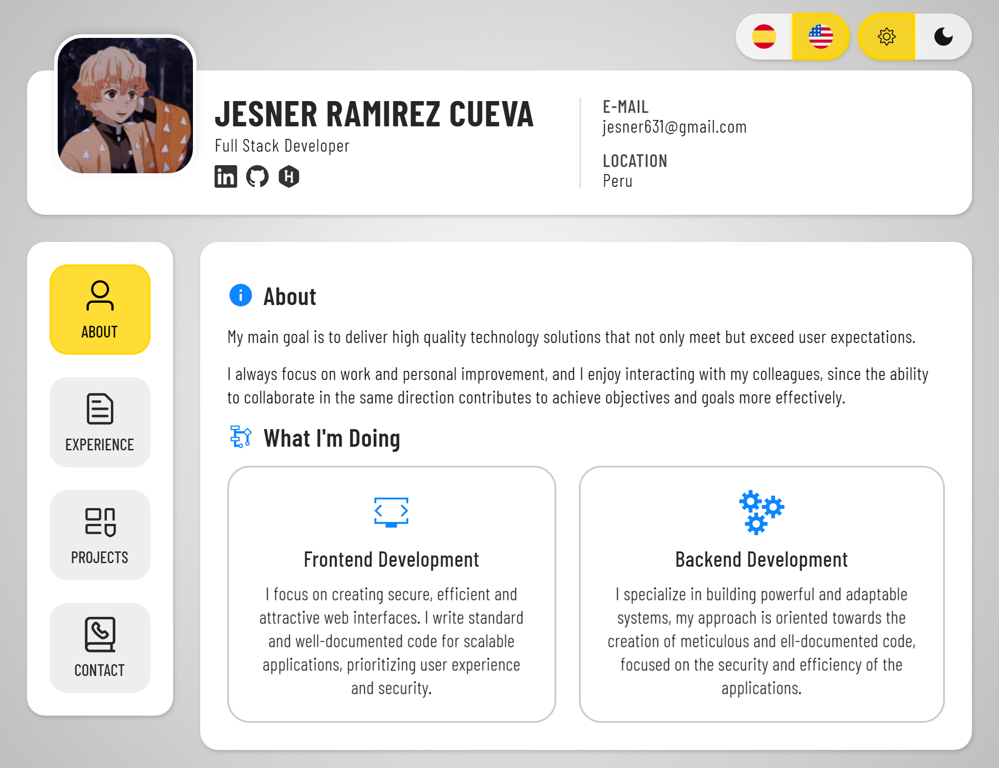

# Porfolio

Configuración básica necesaria para modificación y despliegue.



### Configuración

- Las instrucciones se indicara con “npm”, puede usar también “pnpm, yarn, bun”
- Instalación típica de dependencias (npm install).
- Crear archivo de variables de entorno ".env" para la funcionalidad del correo.

```plaintext
NUXT_PUBLIC_SERVICE_ID=""
NUXT_PUBLIC_TEMPLATE_ID=""
NUXT_PUBLIC_PUBLIC_KEY=""
```

### Modo desarrollador

- Para iniciar el modo desarrollador ejecutar (npm run dev), iniciara por defecto en esta ruta `http://localhost:3000`

### Despliegue

- Para desplegar la pagina ejecutar (npm run generate) para renderizar la pagina, luego ejecutar (npm run deploy) para desplegar, los archivos generados se subiran a la rama “gh-pages”.
